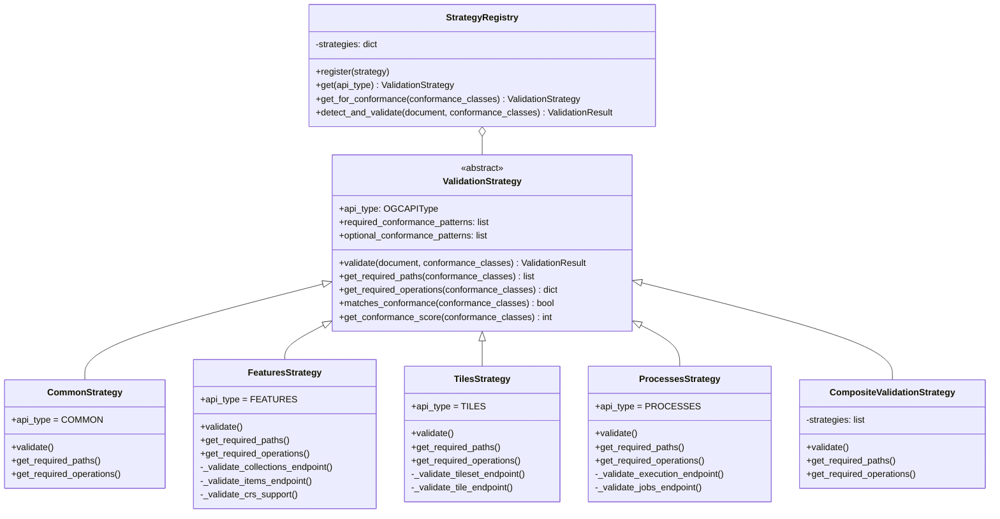

# Architecture

This document describes the architecture of the OGC API Registry library, including the design patterns used and the component structure.

## Overview

The library is built around two main architectural patterns:

1. **Registry Pattern**: For storing and retrieving OpenAPI specifications
2. **Strategy Pattern**: For validating documents based on OGC API conformance classes

## High-Level Architecture


## Strategy Pattern Implementation

The Strategy pattern is the core of the OGC API validation system. It allows different validation logic to be applied based on the conformance classes declared by an API implementation.

### Class Diagram



### Strategy Selection Flow


## Component Details

### OGC API Types

The `OGCAPIType` enum defines all supported OGC API specification types:

```python
class OGCAPIType(str, Enum):
    COMMON = "ogcapi-common"
    FEATURES = "ogcapi-features"
    TILES = "ogcapi-tiles"
    MAPS = "ogcapi-maps"
    PROCESSES = "ogcapi-processes"
    RECORDS = "ogcapi-records"
    COVERAGES = "ogcapi-coverages"
    EDR = "ogcapi-edr"
    STYLES = "ogcapi-styles"
    ROUTES = "ogcapi-routes"
```

### Conformance Classes

Conformance classes are URIs that identify specific capabilities an API supports. The library uses them to:

1. **Detect API Type**: Each conformance class URI contains patterns that identify the API type
2. **Select Validation Strategy**: The appropriate strategy is chosen based on matching conformance patterns
3. **Determine Required Features**: Within a strategy, conformance classes determine which paths and operations are required


### Validation Strategy Behavior

Each strategy validates documents according to conformance class requirements:

| Strategy | Core Requirements | Conformance-Dependent |
|----------|-------------------|----------------------|
| Common | `/`, `/conformance` | `/api` (oas30) |
| Features | `/collections`, `/collections/{id}/items` | CRS params (crs), Filter params (filter) |
| Tiles | `/tiles` (dataset) or collection tiles | TileMatrixSets list (tilesets-list) |
| Processes | `/processes`, `/processes/{id}/execution` | `/jobs` list (job-list), DELETE job (dismiss) |
| Records | `/collections/{id}/items` with `q` param | Sorting, CQL filter |
| EDR | Collection query endpoints | Position, Area, Cube, Trajectory, Corridor |

### Composite Strategy

When an API declares conformance to multiple OGC API types (e.g., Features + Tiles), the `CompositeValidationStrategy` combines validation from all relevant strategies:


## Data Models

### Immutable Models

All data models use Pydantic with `frozen=True` for immutability:


## Thread Safety

The `SpecificationRegistry` uses a reentrant lock (`threading.RLock`) to ensure thread-safe operations:

- All read/write operations acquire the lock
- Iteration returns a copy of the data to avoid modification during iteration
- Immutable models prevent accidental modifications

## OGC Specification Registry

The `OGCSpecificationRegistry` stores reference OGC API specifications indexed by API type, version, and part number.

### Class Diagram


### Version-Aware Validation Flow


### Specification Key Matching

The `OGCSpecificationKey` supports two matching modes:

| Mode | Description | Example |
|------|-------------|---------|
| Strict | Exact version and part match | `1.0` matches `1.0` only |
| Non-strict | Major.minor version match | `1.0` matches `1.0.1` |

## Protocols and Duck Typing

The library uses Python's `Protocol` classes to enable structural subtyping (duck typing). This allows custom implementations without inheritance.

### Protocol Hierarchy


### Runtime Checkable Protocols

All protocols are decorated with `@runtime_checkable`, enabling isinstance() checks:

```python
from ogcapi_registry import ValidationStrategyProtocol

class MyStrategy:
    api_type = OGCAPIType.FEATURES
    # ... implement required methods ...

# Works at runtime
assert isinstance(MyStrategy(), ValidationStrategyProtocol)
```

## Extension Points

The architecture supports several extension points:

### Custom Strategies

You have two options for creating custom strategies:

**Option 1: Inherit from ValidationStrategy (ABC)**

```python
class CustomStrategy(ValidationStrategy):
    api_type = OGCAPIType.CUSTOM  # Add to enum first
    required_conformance_patterns = ["my-custom-api"]

    def validate(self, document, conformance_classes):
        # Custom validation logic
        pass

    def get_required_paths(self, conformance_classes):
        return ["/custom-endpoint"]

    def get_required_operations(self, conformance_classes):
        return {"/custom-endpoint": ["get", "post"]}
```

**Option 2: Duck Typing with Protocol (No Inheritance)**

```python
class CustomStrategy:
    """No inheritance required - just implement the interface."""

    api_type = OGCAPIType.FEATURES

    def validate(self, document, conformance_classes):
        return ValidationResult.success()

    def get_required_paths(self, conformance_classes):
        return ["/custom-endpoint"]

    def get_required_operations(self, conformance_classes):
        return {"/custom-endpoint": ["get", "post"]}

    def matches_conformance(self, conformance_classes):
        return True

# Register without inheritance
registry = StrategyRegistry()
registry.register(CustomStrategy())  # Works!
```

### Custom Conformance Detection

Override `_infer_conformance_from_paths` in `StrategyRegistry` to add custom path-based detection.

### Pre/Post Validation Hooks

Wrap strategies or extend `CompositeValidationStrategy` to add hooks before/after validation.
