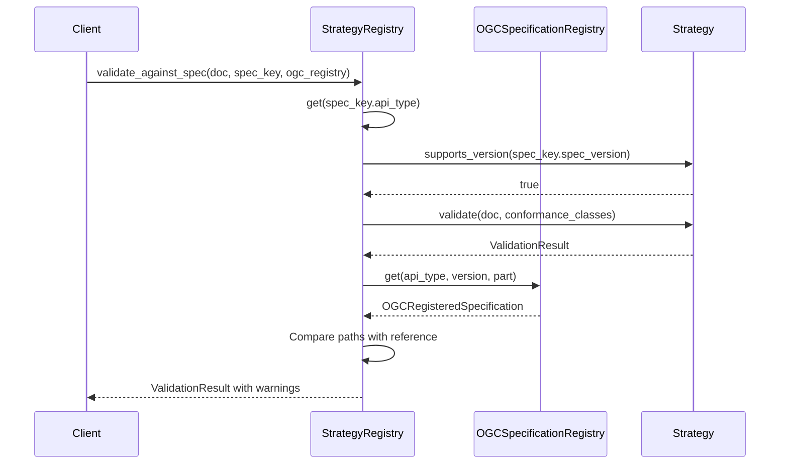

```mermaid
sequenceDiagram
    participant Client
    participant StrategyRegistry
    participant OGCRegistry as OGCSpecificationRegistry
    participant Strategy

    Client->>StrategyRegistry: validate_against_spec(doc, spec_key, ogc_registry)
    StrategyRegistry->>StrategyRegistry: get(spec_key.api_type)
    StrategyRegistry->>Strategy: supports_version(spec_key.spec_version)
    Strategy-->>StrategyRegistry: true

    StrategyRegistry->>Strategy: validate(doc, conformance_classes)
    Strategy-->>StrategyRegistry: ValidationResult

    StrategyRegistry->>OGCRegistry: get(api_type, version, part)
    OGCRegistry-->>StrategyRegistry: OGCRegisteredSpecification

    StrategyRegistry->>StrategyRegistry: Compare paths with reference
    StrategyRegistry-->>Client: ValidationResult with warnings
```
