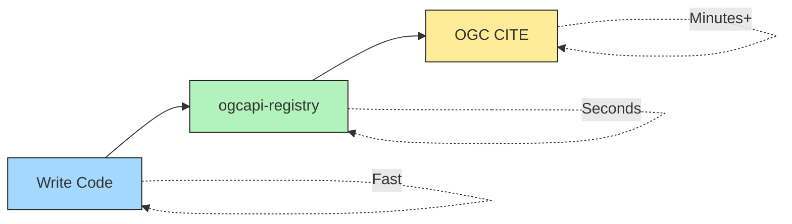

```mermaid
flowchart LR
    A[Write Code] --> B[ogcapi-registry]
    B --> C[OGC CITE]

    A -.-> |Fast| A
    B -.-> |Seconds| B
    C -.-> |Minutes+| C

    style A fill:#a5d8ff,stroke:#1e1e1e
    style B fill:#b2f2bb,stroke:#1e1e1e
    style C fill:#ffec99,stroke:#1e1e1e
```
