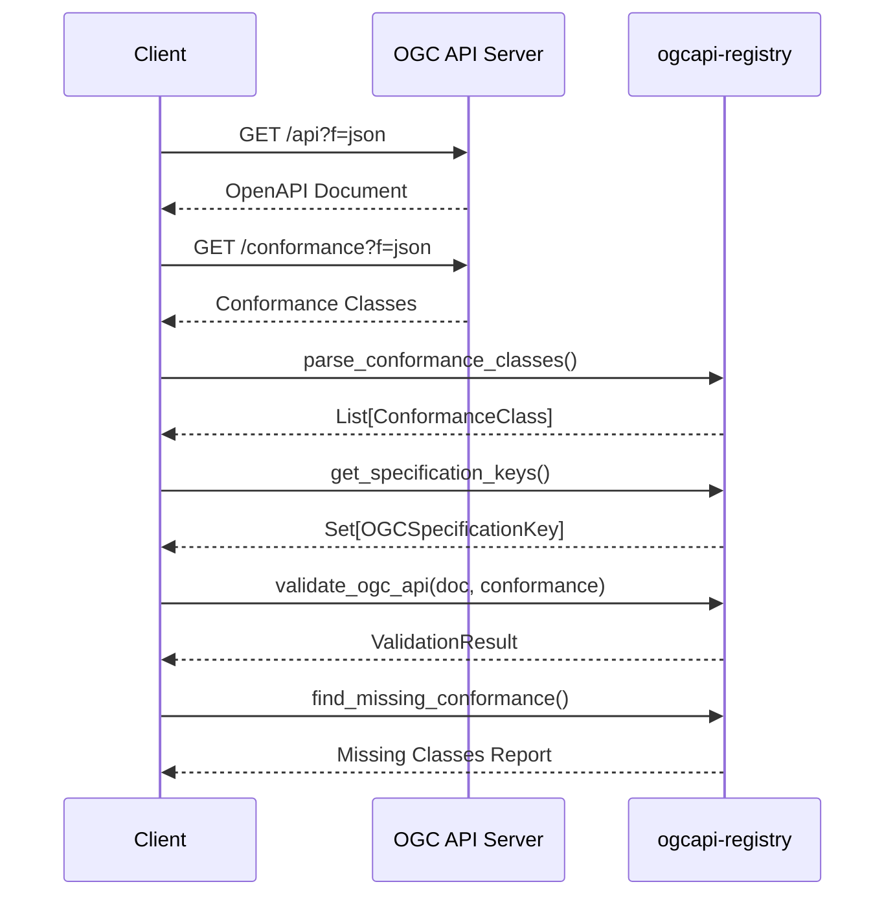

# Examples and Validation Workflow

This document provides detailed examples and explains the complete workflow for validating OGC API implementations.

## Validating a Real OGC API Server

### Workflow Overview



### Step 1: Fetch the OpenAPI Document

```python
from ogcapi_registry import OpenAPIClient

client = OpenAPIClient(timeout=30.0)

# OGC APIs serve OpenAPI at /api endpoint
base_url = "https://demo.ldproxy.net/daraa"
content, metadata = client.fetch(f"{base_url}/api?f=json")

print(f"Title: {content['info']['title']}")
print(f"OpenAPI Version: {content['openapi']}")
print(f"Paths: {len(content['paths'])}")
```

### Step 2: Fetch Conformance Classes

```python
from ogcapi_registry import parse_conformance_classes

# Fetch from /conformance endpoint
conformance_response, _ = client.fetch(f"{base_url}/conformance?f=json")

# Parse into ConformanceClass objects
conformance_classes = parse_conformance_classes(conformance_response)

for cc in conformance_classes:
    print(f"- {cc.conformance_class_name} ({cc.api_type.display_name} v{cc.spec_version})")
```

### Step 3: Analyze Specification Coverage

```python
from ogcapi_registry import (
    get_specification_keys,
    group_conformance_by_spec,
)

# Get unique specification keys
spec_keys = get_specification_keys(conformance_classes)

print("Implemented Specifications:")
for key in spec_keys:
    print(f"  - {key}")
    # Output: OGC API - Features Part 1 v1.0

# Group conformance classes by specification
groups = group_conformance_by_spec(conformance_classes)

for spec_key, classes in groups.items():
    print(f"\n{spec_key}:")
    for cc in classes:
        print(f"  - {cc.conformance_class_name}")
```

### Step 4: Identify Missing Conformance Classes

```python
# Known conformance classes for OGC API - Features Part 1
FEATURES_PART1_CLASSES = {
    "core": "http://www.opengis.net/spec/ogcapi-features-1/1.0/conf/core",
    "oas30": "http://www.opengis.net/spec/ogcapi-features-1/1.0/conf/oas30",
    "html": "http://www.opengis.net/spec/ogcapi-features-1/1.0/conf/html",
    "geojson": "http://www.opengis.net/spec/ogcapi-features-1/1.0/conf/geojson",
    "gmlsf0": "http://www.opengis.net/spec/ogcapi-features-1/1.0/conf/gmlsf0",  # Optional
    "gmlsf2": "http://www.opengis.net/spec/ogcapi-features-1/1.0/conf/gmlsf2",  # Optional
}

# Find which are not declared
declared_uris = {cc.uri.lower() for cc in conformance_classes}

missing = []
for name, uri in FEATURES_PART1_CLASSES.items():
    if uri.lower() not in declared_uris:
        missing.append(name)

print("Missing conformance classes:")
for name in missing:
    print(f"  - {name}")
```

### Step 5: Validate the OpenAPI Document

```python
from ogcapi_registry import validate_ogc_api

result = validate_ogc_api(content, conformance_classes)

if result.is_valid:
    print("✅ Document is valid!")
else:
    print("❌ Validation failed:")
    for error in result.errors:
        print(f"  - [{error['type']}] {error['message']}")

if result.warnings:
    print("⚠️ Warnings:")
    for warning in result.warnings:
        print(f"  - {warning['message']}")
```

### Step 6: Version-Aware Validation (Optional)

```python
from ogcapi_registry import (
    StrategyRegistry,
    OGCSpecificationRegistry,
    OGCSpecificationKey,
    OGCAPIType,
)

# Create registries
strategy_registry = StrategyRegistry()
ogc_registry = OGCSpecificationRegistry()

# Register official reference specification
ogc_registry.register_from_url(
    api_type=OGCAPIType.FEATURES,
    spec_version="1.0",
    url="https://schemas.opengis.net/ogcapi/features/part1/1.0/openapi/ogcapi-features-1.yaml",
    part=1,
)

# Validate against specific version
spec_key = OGCSpecificationKey(
    api_type=OGCAPIType.FEATURES,
    spec_version="1.0",
    part=1,
)

result = strategy_registry.validate_against_spec(
    document=content,
    spec_key=spec_key,
    ogc_registry=ogc_registry,
    conformance_classes=conformance_classes,
)
```

---

## Complete Example Script

A complete example script is available at `examples/validate_ogc_api_server.py`:

```bash
# Run the demo with simulated data
python -m examples.validate_ogc_api_server
```

### Example Output Explained

```
============================================================
DEMO: Simulated OGC API - Features Validation
============================================================

1. OpenAPI Document:
   Title: Daraa
   Version: 3.0.3
   Paths: 7
```

**Explanation**: The OpenAPI document was successfully parsed. It uses OpenAPI 3.0.3 specification and defines 7 API paths.

```
2. Declared Conformance Classes (9):
   - core (OGC API - Features)
   - oas30 (OGC API - Features)
   - html (OGC API - Features)
   - geojson (OGC API - Features)
   - crs (OGC API - Features)
   - core (OGC API - Common)
   - landing-page (OGC API - Common)
   - oas30 (OGC API - Common)
   - json (OGC API - Common)
```

**Explanation**: The server declares 9 conformance classes across multiple OGC API specifications:

| Conformance Class | Meaning |
|------------------|---------|
| `core` (Features) | Implements the basic Features API functionality |
| `oas30` (Features) | API definition follows OpenAPI 3.0 specification |
| `html` (Features) | Supports HTML output format |
| `geojson` (Features) | Supports GeoJSON feature encoding |
| `crs` (Features Part 2) | Supports coordinate reference system handling |
| `core` (Common) | Implements OGC API Common core requirements |
| `landing-page` (Common) | Provides a landing page at `/` |
| `oas30` (Common) | Common API follows OpenAPI 3.0 |
| `json` (Common) | Supports JSON output format |

```
3. Specification Coverage:
   - OGC API - Features Part 1 v1.0
   - OGC API - Features Part 2 v1.0
   - OGC API - Common Part 1 v1.0
```

**Explanation**: Based on the conformance URIs, the server implements three OGC specifications. The version is extracted from the conformance class URI pattern:
```
http://www.opengis.net/spec/ogcapi-features-1/1.0/conf/core
                                             ^^^
                                             version
```

```
4. Missing Conformance Classes:
   OGC API - Features Part 1:
     - gmlsf0 (optional)
     - gmlsf2 (optional)
   OGC API - Common Part 1:
     - html (optional)
```

**Explanation**: These conformance classes are defined in the specifications but not declared by this server:

| Missing Class | Why It's Missing | Impact |
|--------------|------------------|--------|
| `gmlsf0` | Server doesn't support GML Simple Features Level 0 encoding | No GML output available |
| `gmlsf2` | Server doesn't support GML Simple Features Level 2 encoding | No GML output available |
| `html` (Common) | HTML output for Common endpoints not implemented | API responses only in JSON |

These are **optional** conformance classes, so their absence is not an error.

```
5. Validation Result:
   Valid: False
   Errors:
     - Collections GET should have a 200 response
     - Items endpoint should have 'limit' query parameter
     - Items endpoint should have 'bbox' query parameter for spatial filtering
     - CRS conformance requires 'crs' query parameter
     - CRS conformance requires 'bbox-crs' query parameter
```

**Explanation of Each Error**:

### Error: "Collections GET should have a 200 response"

**Cause**: The `/collections` endpoint in the OpenAPI document doesn't define a `200` response.

**OGC Requirement**: OGC API - Features Part 1, Requirement 11 states that the collections endpoint MUST return a 200 response with the list of collections.

**Fix**: Add a 200 response to the path definition:
```yaml
paths:
  /collections:
    get:
      responses:
        '200':
          description: List of feature collections
          content:
            application/json:
              schema:
                $ref: '#/components/schemas/Collections'
```

### Error: "Items endpoint should have 'limit' query parameter"

**Cause**: The `/collections/{collectionId}/items` endpoint doesn't define the `limit` parameter.

**OGC Requirement**: OGC API - Features Part 1, Requirement 17 states that the items endpoint MUST support the `limit` parameter for pagination.

**Fix**: Add the limit parameter:
```yaml
paths:
  /collections/{collectionId}/items:
    get:
      parameters:
        - name: limit
          in: query
          description: Maximum number of features to return
          schema:
            type: integer
            minimum: 1
            maximum: 10000
            default: 10
```

### Error: "Items endpoint should have 'bbox' query parameter"

**Cause**: The items endpoint doesn't define spatial filtering via `bbox`.

**OGC Requirement**: OGC API - Features Part 1, Requirement 19 states that the items endpoint MUST support the `bbox` parameter for spatial filtering.

**Fix**: Add the bbox parameter:
```yaml
parameters:
  - name: bbox
    in: query
    description: Bounding box for spatial filtering
    style: form
    explode: false
    schema:
      type: array
      items:
        type: number
      minItems: 4
      maxItems: 6
```

### Error: "CRS conformance requires 'crs' query parameter"

**Cause**: The server declares CRS conformance (Features Part 2) but the items endpoint doesn't include the `crs` parameter.

**OGC Requirement**: OGC API - Features Part 2, Requirement 4 states that when CRS conformance is declared, the `crs` parameter MUST be available.

**Fix**: Add the crs parameter:
```yaml
parameters:
  - name: crs
    in: query
    description: Coordinate reference system for returned features
    schema:
      type: string
      format: uri
```

### Error: "CRS conformance requires 'bbox-crs' query parameter"

**Cause**: When CRS conformance is declared, `bbox-crs` must be available to specify the CRS of the bbox parameter.

**OGC Requirement**: OGC API - Features Part 2, Requirement 5.

**Fix**: Add the bbox-crs parameter:
```yaml
parameters:
  - name: bbox-crs
    in: query
    description: CRS of the bbox parameter values
    schema:
      type: string
      format: uri
```

---

## Conformance Class Reference

### OGC API - Features

| Part | Conformance Class | URI | Required/Optional | Description |
|------|------------------|-----|-------------------|-------------|
| Part 1 | `core` | `.../ogcapi-features-1/1.0/conf/core` | **Required** | Basic feature access |
| Part 1 | `oas30` | `.../ogcapi-features-1/1.0/conf/oas30` | **Required** | OpenAPI 3.0 definition |
| Part 1 | `html` | `.../ogcapi-features-1/1.0/conf/html` | Optional | HTML encoding |
| Part 1 | `geojson` | `.../ogcapi-features-1/1.0/conf/geojson` | Optional | GeoJSON encoding |
| Part 1 | `gmlsf0` | `.../ogcapi-features-1/1.0/conf/gmlsf0` | Optional | GML SF-0 encoding |
| Part 1 | `gmlsf2` | `.../ogcapi-features-1/1.0/conf/gmlsf2` | Optional | GML SF-2 encoding |
| Part 2 | `crs` | `.../ogcapi-features-2/1.0/conf/crs` | Optional | CRS support |

### OGC API - Common

| Part | Conformance Class | URI | Required/Optional | Description |
|------|------------------|-----|-------------------|-------------|
| Part 1 | `core` | `.../ogcapi-common-1/1.0/conf/core` | **Required** | Core API requirements |
| Part 1 | `landing-page` | `.../ogcapi-common-1/1.0/conf/landing-page` | **Required** | Landing page at `/` |
| Part 1 | `oas30` | `.../ogcapi-common-1/1.0/conf/oas30` | Optional | OpenAPI 3.0 definition |
| Part 1 | `html` | `.../ogcapi-common-1/1.0/conf/html` | Optional | HTML encoding |
| Part 1 | `json` | `.../ogcapi-common-1/1.0/conf/json` | Optional | JSON encoding |
| Part 2 | `collections` | `.../ogcapi-common-2/1.0/conf/collections` | Optional | Collection resources |

### OGC API - Tiles

| Part | Conformance Class | URI | Required/Optional | Description |
|------|------------------|-----|-------------------|-------------|
| Part 1 | `core` | `.../ogcapi-tiles-1/1.0/conf/core` | **Required** | Core tile access |
| Part 1 | `tileset` | `.../ogcapi-tiles-1/1.0/conf/tileset` | **Required** | Tileset metadata |
| Part 1 | `dataset-tilesets` | `.../ogcapi-tiles-1/1.0/conf/dataset-tilesets` | Optional | Dataset-level tiles |
| Part 1 | `geodata-tilesets` | `.../ogcapi-tiles-1/1.0/conf/geodata-tilesets` | Optional | Geodata tiles |

### OGC API - Processes

| Part | Conformance Class | URI | Required/Optional | Description |
|------|------------------|-----|-------------------|-------------|
| Part 1 | `core` | `.../ogcapi-processes-1/1.0/conf/core` | **Required** | Core process execution |
| Part 1 | `ogc-process-description` | `.../ogcapi-processes-1/1.0/conf/ogc-process-description` | Optional | Process descriptions |
| Part 1 | `job-list` | `.../ogcapi-processes-1/1.0/conf/job-list` | Optional | Job listing |
| Part 1 | `dismiss` | `.../ogcapi-processes-1/1.0/conf/dismiss` | Optional | Job cancellation |
| Part 1 | `callback` | `.../ogcapi-processes-1/1.0/conf/callback` | Optional | Async callbacks |

### OGC API - EDR (Environmental Data Retrieval)

| Part | Conformance Class | URI | Required/Optional | Description |
|------|------------------|-----|-------------------|-------------|
| Part 1 | `core` | `.../ogcapi-edr-1/1.0/conf/core` | **Required** | Core EDR functionality |
| Part 1 | `collections` | `.../ogcapi-edr-1/1.0/conf/collections` | Optional | Collection support |
| Part 1 | `position` | `.../ogcapi-edr-1/1.0/conf/position` | Optional | Point queries |
| Part 1 | `area` | `.../ogcapi-edr-1/1.0/conf/area` | Optional | Area queries |
| Part 1 | `cube` | `.../ogcapi-edr-1/1.0/conf/cube` | Optional | Cube queries |
| Part 1 | `trajectory` | `.../ogcapi-edr-1/1.0/conf/trajectory` | Optional | Trajectory queries |
| Part 1 | `corridor` | `.../ogcapi-edr-1/1.0/conf/corridor` | Optional | Corridor queries |

### OGC API - Coverages

| Part | Conformance Class | URI | Required/Optional | Description |
|------|------------------|-----|-------------------|-------------|
| Part 1 | `core` | `.../ogcapi-coverages-1/1.0/conf/core` | **Required** | Core coverage access |
| Part 1 | `geodata-coverage` | `.../ogcapi-coverages-1/1.0/conf/geodata-coverage` | Optional | Geodata coverages |

### OGC API - Maps

| Part | Conformance Class | URI | Required/Optional | Description |
|------|------------------|-----|-------------------|-------------|
| Part 1 | `core` | `.../ogcapi-maps-1/1.0/conf/core` | **Required** | Core map rendering |
| Part 1 | `dataset-map` | `.../ogcapi-maps-1/1.0/conf/dataset-map` | Optional | Dataset maps |
| Part 1 | `geodata-map` | `.../ogcapi-maps-1/1.0/conf/geodata-map` | Optional | Geodata maps |

### OGC API - Styles

| Part | Conformance Class | URI | Required/Optional | Description |
|------|------------------|-----|-------------------|-------------|
| Part 1 | `core` | `.../ogcapi-styles-1/1.0/conf/core` | **Required** | Core style management |
| Part 1 | `manage-styles` | `.../ogcapi-styles-1/1.0/conf/manage-styles` | Optional | CRUD operations |
| Part 1 | `validation` | `.../ogcapi-styles-1/1.0/conf/validation` | Optional | Style validation |

### OGC API - Routes

| Part | Conformance Class | URI | Required/Optional | Description |
|------|------------------|-----|-------------------|-------------|
| Part 1 | `core` | `.../ogcapi-routes-1/1.0/conf/core` | **Required** | Core routing |
| Part 1 | `manage-routes` | `.../ogcapi-routes-1/1.0/conf/manage-routes` | Optional | Route management |

---

## Validation Error Types

The library produces different error types to help categorize issues:

| Error Type | Description | Severity |
|------------|-------------|----------|
| `missing_required_path` | A required API endpoint is not defined | Error |
| `missing_required_operation` | A required HTTP method is not defined for a path | Error |
| `missing_parameter` | A required query/path parameter is missing | Error |
| `missing_response` | A required response code is not defined | Error |
| `unsupported_version` | The declared spec version is not supported | Error |
| `missing_reference_path` | A path from reference spec is not found | Warning |
| `version_mismatch` | OpenAPI version differs from expected | Warning |

---

## Troubleshooting Common Issues

### Issue: "Validation passes but server doesn't work"

**Cause**: The library validates the OpenAPI document structure, not the actual server implementation.

**Solution**: Use tools like the OGC CITE test suite for runtime compliance testing.

### Issue: "Too many missing conformance class warnings"

**Cause**: The server may implement a minimal subset of the specification.

**Solution**: Focus on **required** conformance classes first. Optional classes can be implemented incrementally.

### Issue: "Cannot parse conformance classes"

**Cause**: The conformance URI format may not match expected patterns.

**Solution**: Verify URIs follow the pattern:
```
http://www.opengis.net/spec/ogcapi-{type}-{part}/{version}/conf/{class}
```
